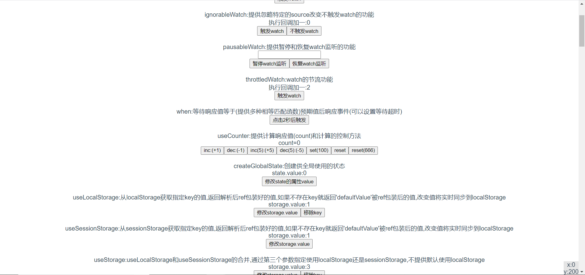
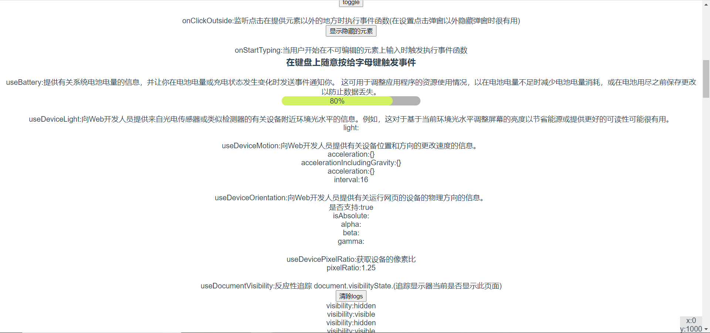
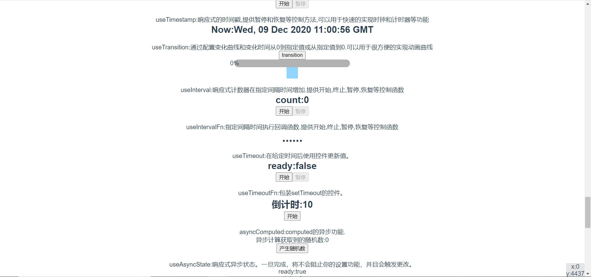
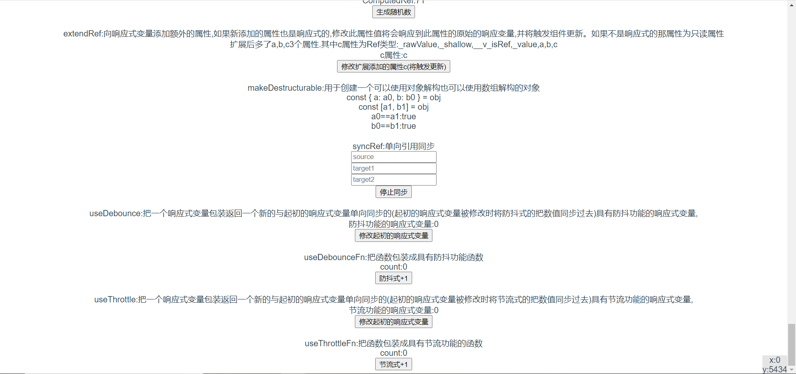

<!--
 * @Author: your name
 * @Date: 2020-12-09 10:56:21
 * @LastEditTime: 2020-12-09 11:07:57
 * @LastEditors: your name
 * @Description: In User Settings Edit
 * @FilePath: \vueuse-study\README.md
-->
* 对vueuse的学习
* 使用 npm run dev
* <a href="https://liaozhongren.github.io/vueuse-study/show/index.html">演示地址</a>
* 演示截图
 
 
 
 

